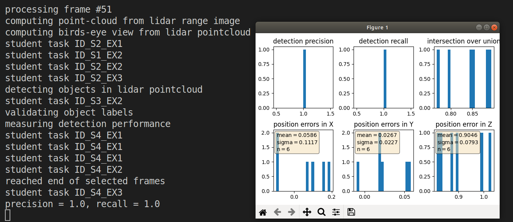

# Writeup: Mid-Term report

A car very close to the ego-vehicle, bottom half cannot be detected.

A car close to the ego-vehicle, the side to the ego-vehicle is well visible from the lidar.

A Trailer in front of the ego-vehicle, a part is occluded from itself.

Car in front of the ego-vehicle, partly occluded by the car between itself and the ego-vehicle.

Cars far away, heavily occluded.

Cars behind the ego-vehicle, the front side of them are visible.

The front/rear bumper are quite stable features.

Detection results from darknet pretrained model:

# Writeup: Track 3D-Objects Over Time

Please use this starter template to answer the following questions:

### 1. Write a short recap of the four tracking steps and what you implemented there (filter, track management, association, camera fusion). Which results did you achieve? Which part of the project was most difficult for you to complete, and why?

#### **Step 1:** Filter

I implemented missing parts of an Extended Kalman Filter and run the code on a sequence. One vehicle is successfully tracked.

#### **Step 2:** Track Management

Then track managing functions are implemented. Hard coded initialization parameters are replaced by data read from the measurements. Track scores are updated through every frame, and the track state is set based on the updated track score. A function deleting tracks is also implemented. After implemented this, the RMSE becomes mores stable in the initialization phase. 

#### **Step 3:** Association

Here association is added to enable multi-object tracking. The MHD is calculated for each pair of track and measurement to update an association matrix. Then most possible track-measurement correspondences are determined from the minimal value of the association matrix.

The are some constant false positives, but the RMSEs of them were not high and they didn't end up in the final RMSE report.
 

#### **Step 4:** Sensor Fusion

### 2. Do you see any benefits in camera-lidar fusion compared to lidar-only tracking (in theory and in your concrete results)? 
Theorectically , fusing sensors can combine the different strengths of different sensors, for example the distance measured by lidar and RGB values measured by camera. Camera-lidar fusion can give a input of rich dense information from camera and solve the problem such as occlusion to some extent. Also, have different sensor inputs can increase the robustness of the outcome.

From the experiments done in this project, one can also see the RMSE of track 1 is decrease from 0.15 to 0.10 after adding the camera input.

### 3. Which challenges will a sensor fusion system face in real-life scenarios? Did you see any of these challenges in the project?
The first challenge is to have an accurate calibration, which is not as easy to get as one thinks. Inference results of data from different sensor might differ, this introduces difficulty of deciding which final outcome should be generated.

### 4. Can you think of ways to improve your tracking results in the future?
The algorithm should be fine tuned over a larger and more complicated dataset.

It is also possible to fuse other information from camera side, maybe from another network, such as object detection and semantic segmentation.

