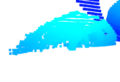
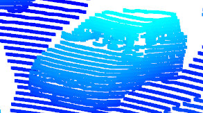
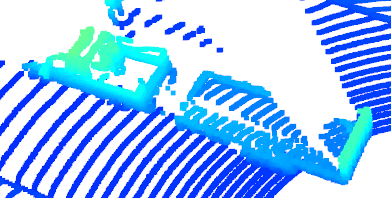
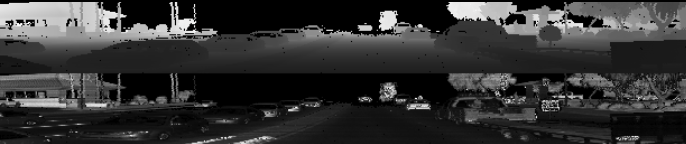

# Writeup: Mid-Term report

A car very close to the ego-vehicle, bottom half cannot be detected.

A car close to the ego-vehicle, the side to the ego-vehicle is well visible from the lidar.

A Trailer in front of the ego-vehicle, a part is occluded from itself.

Car in front of the ego-vehicle, partly occluded by the car between itself and the ego-vehicle.

Cars far away, heavily occluded.

Cars behind the ego-vehicle, the front side of them are visible.

The front/rear bumper are quite stable features.

# Writeup: Track 3D-Objects Over Time

Please use this starter template to answer the following questions:

### 1. Write a short recap of the four tracking steps and what you implemented there (filter, track management, association, camera fusion). Which results did you achieve? Which part of the project was most difficult for you to complete, and why?

### 2. Do you see any benefits in camera-lidar fusion compared to lidar-only tracking (in theory and in your concrete results)? 

### 3. Which challenges will a sensor fusion system face in real-life scenarios? Did you see any of these challenges in the project?

### 4. Can you think of ways to improve your tracking results in the future?

